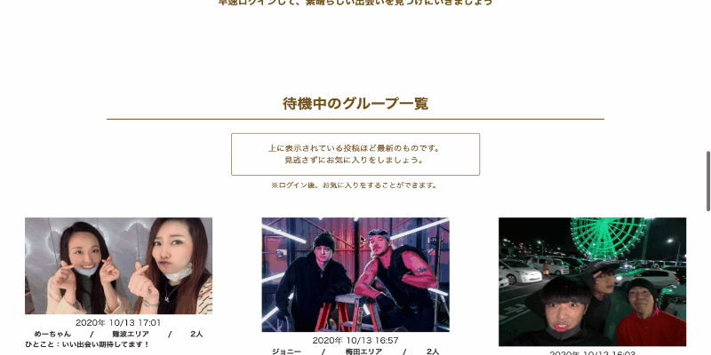

# アプリ名
SUGU

# 概要
このアプリでは、「今」時間が空いている異性とすぐに合コンをすることができるアプリです。

# 本番環境
デプロイ先 : https://sugu-sugu.herokuapp.com/

テストアカウント① &nbsp;**email** : test1@test.test &nbsp;  **password** : aaaa11

テストアカウント② &nbsp;**email** : test2@test.test &nbsp;  **password** : aaaa11

# 制作背景
私はナンパをするのが苦手です。  
私は営業マン時代、仕事終わりに上司によく繁華街に連れていってもらっていました。1軒目を出た後に、上司は異性とお酒を飲みたくなり「ナンパしてこい。」と私を促します。しかし私はナンパが大の苦手で失敗ばかりでした。このような経験から、ナンパをするのは非常に嫌なことでした。  
そこで、このアプリを制作いたしました。これさえあれば、直接女性に声をかけることなくチャットをするだけで女性と食事をすることができます。

# 利用方法  
①ログインします  
②現在の自分の状況を投稿します  
③他のユーザーの投稿をお気に入りします  
④そのユーザーが自分の投稿をお気に入りすると、マッチングになります  
⑤マッチするとチャットができるようになります  

# 機能紹介  
アプリの主要機能を紹介します。  
- ユーザー管理機能
- 合コン情報の投稿・編集機能
- 合コン情報の詳細検索機能
- お気に入り登録機能
- マッチング機能
- チャット機能
# DEMO  
アプリの雰囲気と挙動をGIf動画で見ていただきます。  
## トップページ  
ログインしていない状態では、合コン情報を投稿している全ユーザーが表示されます。ログインすると、その中の異性のものだけが表示されます。  
  
  
  
## お気に入り機能  
非同期通信でお気に入りボタンを押せるようにしています。一番右の投稿に対してお気に入りボタンをしています。  
  
  
  
## 詳細検索機能  
「エリア」と「人数」を指定して投稿情報を検索できます。このGIFでは「エリア」が梅田、「人数」が指定なしなので、「エリアが梅田」の情報が結果で表示されます。  
  
  
  
## マッチング機能（ルーム作成機能）  
一度チャットルームを作成しているユーザーはセレクトボックスに表示されないようにしています。GIFでは3人とマッチしていますが、セレクトボックス内には1人の名前しか表示されていません。これは、他の二人とのチャットルームがすでに作成されているためです。  
  
  
  
## チャット機能  
既存のチャットアプリのように、自分の投稿が右側に出るように工夫しました。  
  
  
  
## レスポンシブデザイン  
全ての画面で、レスポンシブデザインに対応しております。  
  
  

 
# 工夫したポイント
マッチング機能の作成を工夫しました。  
このアプリでのマッチングの定義は、「ユーザー達がお互いの投稿した情報に対して、そのお互い同士でお気に入りをする」ということです。Twitterで例えると、ユーザーAがユーザーBのツイートを、ユーザーBがユーザーAのツイートにお気に入りをした状態です。これをコードで定義をすることに注力しました。具体的には、DBからデータを取り出す方法をいくつも調べ、何個も実践しました。  
その結果、自力でマッチングさせることができ、自信を持つことができました。
# 使用技術(開発環境)
【言語】
HTML5、CSS3、Ruby、JavaScript  

【OS】
macOS  

【DB】
Sequel Pro  

【フレームワーク】
Ruby on Rails

# 課題や今後実装したい機能
課題は、毎回チャットルームを作成しなければいけないことです。  
これがあることでユーザビリティが低くなってしまいます。現段階ではこれを解消することができませんでした。  
今後実装したい機能は、チャットルームの中のメッセージを非同期通信させることです。  

# ER図  
  

# DB設計
### users テーブル

| Column             | Type    | Options     |
| ------------------ | ------- | ----------- |
| nickname           | string  | null: false |
| gender             | string  | null: false |
| email              | string  | null: false |
| password           | string  | null: false |

#### Association

- has_one   :user_info
- has_many  :favorites, dependent: :destroy
- has_many  :favarite_user_infos, through: :favorites, source: :user_info
- has_many  :rooms, through: :room_users
- has_many  :room_users
- has_many  :messages

### user_infos テーブル

| Column           | Type       | Options                        |
| ---------------- | ---------- | ------------------------------ |
| text             | text       | null: false                    |
| people_num_id    | integer    | null: false                    |
| area_id          | integer    | null: false                    |
| user             | references | null: false, foreign_key: true |

#### Association

- belongs_to             :user
- has_one_attached       :image 
- has_many               :favorites, dependent: :destroy
- has_many               :favorite_users, through: :favorites, source: :user
- belongs_to_active_hash :area
- belongs_to_active_hash :people_num

###  rooms テーブル
| Column         | Type       | Options                        |
| -------------- | ---------- | ------------------------------ |

#### Association
- has_many   :room_users
- has_many   :users, through: room_users
- has_many   :messages

### room_users テーブル

| Column       | Type       | Options                        |
| ------------ | ---------- | ------------------------------ |
| user         | references | null: false, foreign_key: true |
| room         | references | null: false, foreign_key: true |

#### Association

- belongs_to :room
- belongs_to :user

###  favorites テーブル

| Column       | Type       | Options                        |
| ------------ | ---------- | ------------------------------ |
| user_id      | integer    |                                |
| user_info_id | integer    |                                |

#### Association

- belongs_to :user
- belongs_to :user_info

###  messages テーブル

| Column     | Type       | Options                        |
| ---------- | ---------- | ------------------------------ |
| content    | string     |                                |
| user       | references | null: false, foreign_key: true |
| room       | references | null: false, foreign_key: true |

#### Association

- belongs_to :room
- belongs_to :user

